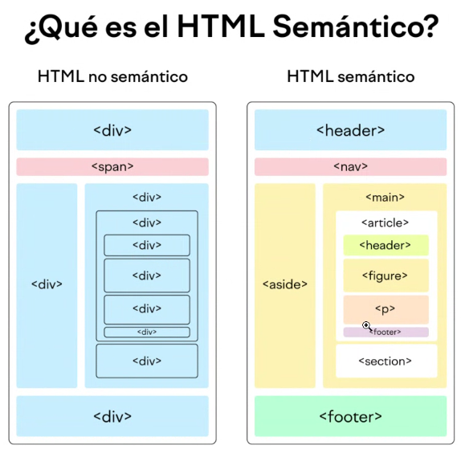

# Clase 4

- [Clase 4](#clase-4)
  - [Terminar con HTML](#terminar-con-html)
  - [CSS](#css)

---

## Terminar con HTML

- ¿Qué es el HTML Semántico?
  - Etiquetas Semánticas
    - **\<header\>**: encabezado
    - **\<nav\>**: barra de navegación
    - **\<aside\>**: contenido afuera del principal
    - **\<main\>**
    - **\<article\>**: artículo independiente, porción repetible de información
    - **\<figure\>**
    - **\<section\>**: agrupar contenido similar, agrupar articles en un section
    - **\<footer\>**: información a pie de página
  - SEO
  - Accesibilidad
- Layout: todo lo que se mantiene fijo entre vistas

  - Estructuración del contenido con las etiquetas

  

## CSS
